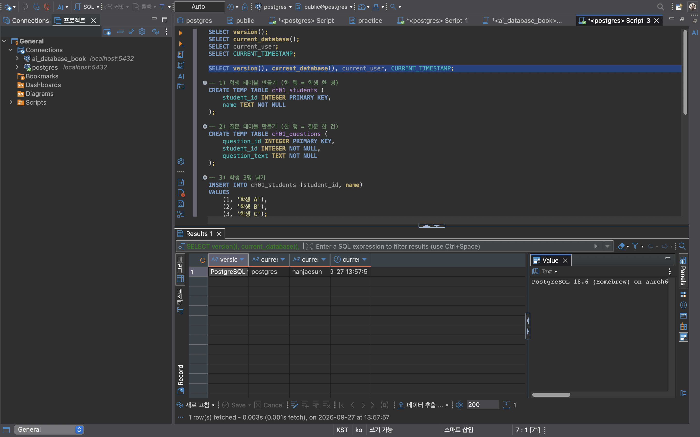
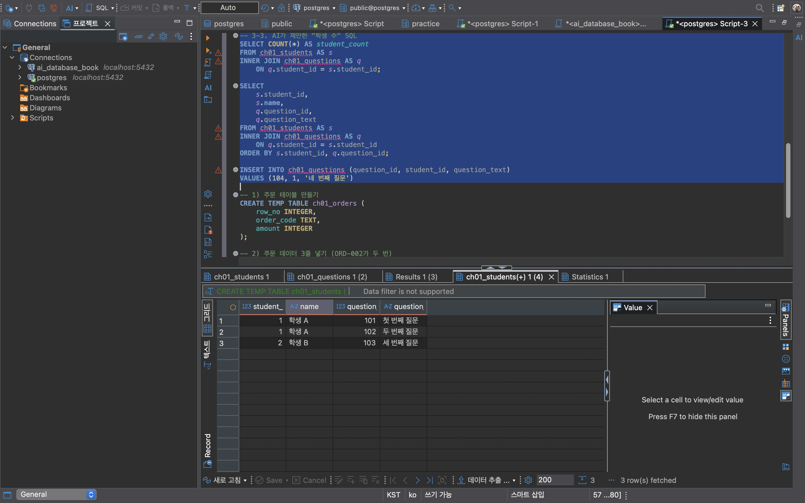
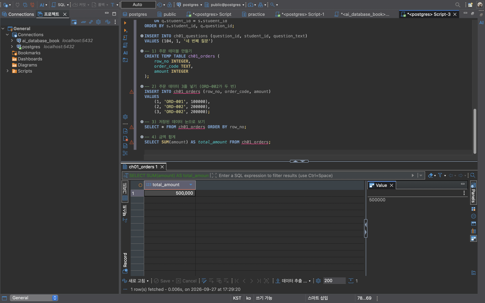
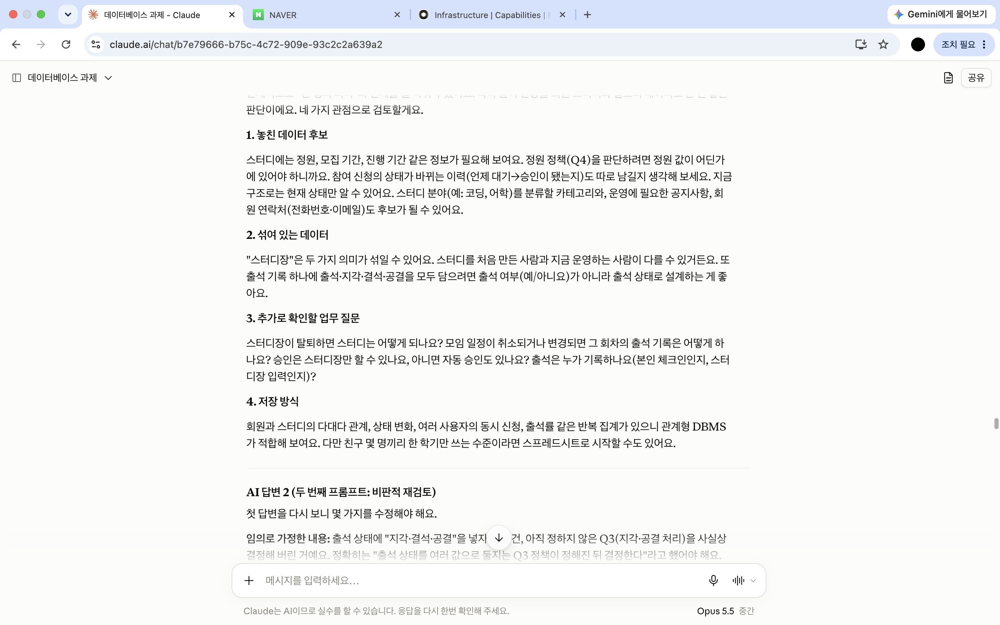

# Chapter 01 확장 실습 답안 템플릿

> **과제:** AI 시대에 데이터베이스를 왜 배워야 하는가  
> **사용 방법:** 이 파일을 내려받아 **본인의 GitHub 저장소**에 `chapter01_answer.md`라는 이름으로 저장한 뒤 답안을 작성합니다.  
> **제출 방법:** LMS에는 파일을 업로드하지 않고, **본인 GitHub 저장소의 `chapter01_answer.md` 파일 URL**을 제출합니다.

---

## 0. 학생 정보

| 항목 | 작성 내용 |
| --- | --- |
| 학번 | (LMS 제출로 확인 가능하여 생략) |
| 이름 | (LMS 제출로 확인 가능하여 생략) |
| GitHub 계정 | han-jaesun |
| 과제 작성일 | 2026-09-24 |
| 사용한 AI 도구 | Claude |

> 실제 비밀번호, API Key, 전체 DB 접속 URL, 개인정보는 이 파일이나 캡처 화면에 기록하지 않습니다.

---

# 1. PostgreSQL 실행 환경 확인

## 1-1. 실행한 SQL

```sql
SELECT version();
SELECT current_database();
SELECT current_user;
SELECT CURRENT_TIMESTAMP;
```

## 1-2. 실행 결과 기록

```text
PostgreSQL 버전: PostgreSQL 18.6 (Homebrew) on aarch64-apple-darwin24.6.0
현재 데이터베이스: postgres
현재 사용자: hanjaesun
현재 시각: 2026-09-27 13:57:57.955 +0900
```

## 1-3. 내가 확인한 내용

1. SQL을 작성하는 프로그램과 PostgreSQL은 같은 프로그램인가요?

```text
나의 답:
같은 프로그램이 아니다. DBeaver는 SQL을 작성해서 보내고 결과를 보여주는 클라이언트 도구이고,
PostgreSQL은 내 컴퓨터(localhost:5432)에서 따로 실행되는 데이터베이스 서버이다.
```

2. `current_database()` 결과는 무엇을 의미하나요?

```text
나의 답:
현재 연결된 세션이 PostgreSQL 서버 안의 여러 데이터베이스 중 어느 데이터베이스에 접속해 있는지를 의미한다.
결과가 postgres로 나왔으므로 지금 실행하는 SQL과 만드는 테이블은 postgres 데이터베이스 안에서 처리된다.
```

3. SQL이 실행되었다는 사실만으로 데이터 내용도 올바르다고 할 수 있나요?

```text
나의 답:
그렇지 않다. SQL이 실행되었다는 것은 문법 오류 없이 처리되었다는 의미일 뿐이다.
요구사항과 다른 대상을 세거나 데이터에 중복·누락이 있어도 SQL은 오류 없이 결과를 낸다.
따라서 실행 결과가 실제 질문에 맞는 값인지는 사람이 따로 확인해야 한다.
```

## 1-4. 증거 화면

아래 경로에 캡처 이미지를 저장하는 것을 권장합니다.

```text
assignments/chapter01/images/step01_environment.png
```



---

# 2. Chapter 01 핵심 내용 복습

교재 문장을 그대로 복사하지 말고 자신의 말로 작성합니다.

| 본문의 핵심 | 나의 설명 |
| --- | --- |
| AI가 SQL을 만들어도 DB를 배워야 한다 | AI가 만든 SQL은 그럴듯해 보여도 요구사항과 다른 것을 셀 수 있다. 그 SQL이 무엇을 계산하는지 판단하려면 결국 사람이 데이터베이스의 원리를 알아야 한다. |
| 데이터 구조가 중요하다 | 테이블의 한 행이 무엇을 의미하는지, 데이터끼리 어떻게 연결되는지에 따라 같은 SQL도 전혀 다른 결과를 낸다. 구조를 모르면 결과를 해석할 수 없다. |
| SQL 결과를 검증해야 한다 | SQL은 문법만 맞으면 오류 없이 결과를 낸다. 그 숫자가 실제 질문에 맞는지는 예상값과 비교하거나 원본 데이터를 직접 보면서 확인해야 한다. |
| 데이터 품질이 AI 답변 품질에 영향을 준다 | AI는 주어진 데이터를 사실로 받아들이고 분석한다. 중복이나 누락이 있는 데이터를 넣으면 AI도 틀린 숫자를 바탕으로 그럴듯한 결론을 만들어 낸다. |
| 저장 방식은 데이터 양만 보고 선택하지 않는다 | 데이터가 적어도 여러 사람이 동시에 수정하거나, 데이터 사이의 관계가 복잡하거나, 권한과 복구가 중요하면 DBMS가 필요할 수 있다. 양보다 사용 방식과 요구사항이 더 중요하다. |

## 가장 중요하다고 생각한 한 문장

```text
AI가 만든 SQL은 정답이 아니라 검토할 초안이며, 실행 결과가 맞는지는 사람이 데이터로 확인해야 한다.
```

---

# 3. 실행 성공과 결과 정확성의 차이

## 3-1. SQL 실행 전 예상

학생 A는 질문 2개, 학생 B는 질문 1개, 학생 C는 질문이 없습니다.

```text
전체 학생 수: 3 명
전체 질문 수: 3 개
질문이 있는 학생 수: 2 명
질문이 없는 학생 수: 1 명
```

## 3-2. 임시 테이블 생성 및 데이터 입력 완료 확인

- [O] `ch01_students` 생성
- [O] `ch01_questions` 생성
- [O] 학생 3명 입력
- [O] 질문 3건 입력
- [O] 두 테이블의 데이터를 직접 조회

## 3-3. 잘못된 학생 수 SQL 실행 결과

실행한 SQL:

```sql
SELECT COUNT(*) AS student_count
FROM ch01_students AS s
INNER JOIN ch01_questions AS q
    ON q.student_id = s.student_id;
```

실행 결과:

```text
student_count = 3
```

## 3-4. JOIN 상세 결과 관찰

```text
학생 A가 나타난 행 수: 2
학생 B가 나타난 행 수: 1
학생 C가 나타난 행 수: 0
```

다음 질문에 답합니다.

### Q1. 학생 C가 왜 결과에서 사라졌나요?

```text
INNER JOIN은 두 테이블에서 student_id가 서로 맞는 짝이 있는 행만 남긴다.
학생 C는 작성한 질문이 하나도 없어서 질문 테이블에 짝이 되는 행이 없으므로 결과에서 빠졌다.
```

### Q2. 학생 A가 왜 여러 행으로 나타났나요?

```text
학생 A는 질문을 2개(101, 102) 작성했기 때문에, 학생 A 한 명이 질문 두 건과 각각 짝지어져 2행이 되었다.
JOIN 결과의 한 행은 학생 한 명이 아니라 "학생과 질문 한 건의 조합"이다.
```

### Q3. 위 `COUNT(*)`가 실제로 세고 있었던 것은 무엇인가요?

```text
학생 수가 아니라 INNER JOIN으로 만들어진 "학생-질문 짝"의 행 수, 즉 질문이 있는 학생들의 질문 건수를 세고 있었다.
결과 3은 학생 A의 2행과 학생 B의 1행을 더한 값이다.
```

### Q4. 결과 숫자가 우연히 실제 학생 수와 같아도 바로 믿으면 안 되는 이유는 무엇인가요?

```text
이번에는 학생 C가 빠진 1명과 학생 A가 중복된 1명이 서로 상쇄되어 우연히 3이 나왔을 뿐이다.
데이터가 조금만 바뀌어도 결과가 달라질 수 있으므로, 숫자가 맞아 보이는지가 아니라
SQL이 무엇을 세고 있는지와 한 행의 의미를 확인해야 한다.
```

## 3-5. 질문 한 건을 추가한 뒤 다시 실행

추가한 데이터:

```text
INSERT INTO ch01_questions (question_id, student_id, question_text)
VALUES (104, 1, '네 번째 질문');

→ 학생 A(student_id = 1)가 질문을 하나 더 작성한 상황
```

다시 실행한 결과:

```text
AI SQL 결과: 4
실제 학생 수: 3
```

### 결과 해석

```text
데이터가 바뀐 뒤 무엇이 달라졌는지:
학생 A의 질문이 3개가 되면서 INNER JOIN 결과에서 학생 A가 3행으로 늘어났고,
AI SQL의 결과도 3에서 4로 바뀌었다.

실제 학생 수는 왜 그대로인지:
학생 테이블에는 아무 변화가 없고 질문 테이블에만 한 건이 추가되었기 때문이다.
학생은 여전히 A, B, C 세 명이다.

이 실험을 통해 알게 된 점:
처음에 나온 3은 학생 수가 아니라 질문과 짝지어진 행 수였고, 우연히 학생 수와 같았을 뿐이다.
질문이 하나 늘자 결과가 바로 달라진 것을 보고, AI SQL이 요구사항과 다른 것을 세고 있었다는 것을 확인했다.
SQL이 오류 없이 실행되어도 업무 질문에 맞는 답이 나온다는 보장은 없다.
```

## 3-6. 학생 테이블을 직접 센 결과

```sql
SELECT COUNT(*) AS student_count
FROM ch01_students;
```

결과:

```text
student_count = 3
```

### 두 SQL의 차이를 내 말로 설명

```text
첫 번째 SQL은 학생과 질문을 짝지은 JOIN 결과의 행 수(질문이 있는 학생의 질문 건수)를 세고 있었다.

두 번째 SQL은 학생 테이블의 행 수, 즉 실제 학생 수를 세고 있었다.

따라서 SQL을 검토할 때는 문법보다 먼저
결과의 한 행이 무엇을 의미하는지, 누락되거나 중복된 대상은 없는지를 확인해야 한다.
```

## 3-7. 증거 화면

권장 경로:

```text
assignments/chapter01/images/step03_join_result.png
```



---

# 4. 잘못된 데이터가 결과를 바꾸는 과정

## 4-1. 주문 데이터 확인

다음 데이터를 입력한 뒤 실제 결과를 확인합니다.

```text
ORD-001, 100000
ORD-002, 200000
ORD-002, 200000
```

## 4-2. 실행 전 예상

업무적으로 주문이 `ORD-001`, `ORD-002` 두 건이고 `order_code`가 주문을 고유하게 구분한다고 **가정할 경우** 예상 합계:

```text
300,000 원
```

> 위 가정 자체가 실제 업무 규칙인지 확인해야 한다는 점도 기억합니다.

## 4-3. SQL 합계

```sql
SELECT SUM(amount) AS total_amount
FROM ch01_orders;
```

실제 결과:

```text
500,000 원
```

## 4-4. 결과 해석

### `SUM` 문법 자체가 잘못된 것인가요?

```text
아니다. SUM은 테이블에 저장된 세 행의 amount를 정확하게 더했다.
SQL은 요청받은 계산을 그대로 수행했을 뿐이다.
```

### 결과 차이의 원인은 무엇인가요?

```text
ORD-002 주문이 두 행으로 저장되어 있기 때문이다.
order_code가 주문을 고유하게 구분한다고 가정하면 ORD-002는 한 건이어야 하므로
200,000원이 한 번 더 더해져 예상보다 200,000원 많은 500,000원이 나왔다.
```

### SQL이 정확하게 실행되어도 업무 숫자가 잘못될 수 있는 이유를 설명하세요.

```text
SQL은 저장된 데이터가 맞다고 전제하고 계산한다.
데이터에 중복이나 잘못된 입력이 있으면 SQL은 오류 없이 실행되지만 결과는 틀린 업무 숫자가 된다.
그리고 이 숫자를 AI나 사람이 그대로 분석에 쓰면 잘못된 의사결정으로 이어질 수 있다.
따라서 SQL뿐 아니라 데이터 자체의 품질과 업무 규칙(중복 허용 여부 등)도 확인해야 한다.
```

## 4-5. AI에게 같은 데이터를 분석시킨 결과

AI가 계산한 합계:

```text
500,000원 (주어진 세 행을 그대로 더한 값)
단, 중복이라면 실제 총액은 300,000원일 수 있다고 함께 제시했다.
```

AI가 중복 가능성을 언급했나요?

```text
언급했다. ORD-002가 같은 금액으로 두 번 나오는 점을 지적하고,
중복 입력일 가능성과 한 주문에 여러 상품이 들어간 경우일 가능성을 모두 제시했다.
```

AI가 `ORD-002` 두 행이 실제 두 주문인지 중복 입력인지 스스로 확정할 수 있나요? 이유도 적으세요.

```text
확정할 수 없다. 데이터에는 주문 코드와 금액만 있고, 주문 코드가 고유한지,
한 주문에 여러 행이 들어갈 수 있는지 같은 업무 규칙이 들어 있지 않기 때문이다.
AI도 이 점을 인정하고 확인이 필요하다고 답했다.
```

추가로 확인해야 할 업무 규칙:

```text
1. order_code가 주문 한 건을 고유하게 구분하는 값인가?
2. 한 주문에 여러 상품(행)이 들어갈 수 있는 구조인가?
3. 원본 결제 시스템에서 ORD-002의 실제 결제 금액과 건수는 얼마인가?
```

내가 최종적으로 내린 판단:

```text
과제의 가정처럼 order_code가 주문을 고유하게 구분한다면 ORD-002는 중복 입력이고,
올바른 총 주문 금액은 300,000원이다.
하지만 이 가정은 데이터 안에 들어 있지 않으므로, 업무 담당자에게 규칙을 확인하기 전까지는
500,000원을 확정된 매출로 사용하지 않는다.
AI는 중복 가능성을 잘 짚어 주었지만 최종 판단은 업무 규칙을 아는 사람이 해야 한다.
```

## 4-6. 증거 화면

```text
권장 경로: assignments/chapter01/images/step04_duplicate_result.png
```



---

# 5. 파일·스프레드시트·DBMS 선택 연습

각 사례에 대해 **AI에게 묻기 전에 먼저 본인의 판단을 작성**합니다.

## 사례 A. 개인 독서 기록

```text
나의 선택: 파일(메모장·Markdown) 또는 스프레드시트
선택 이유: 혼자 사용하고 한 달에 5건 정도로 추가 속도가 느리며, 책 제목·날짜·메모처럼 단순한 정보만 기록한다.
동시 수정, 복잡한 관계, 권한 관리가 필요 없으므로 DBMS를 설치하고 관리하는 비용이 더 크다.
어떤 조건이 추가되면 다른 방식으로 바꿀 것인지: 여러 사람이 함께 기록하거나, 저자·출판사·장르처럼
여러 대상 사이의 관계를 관리하거나, 앱으로 만들어 계속 조회·통계를 내야 한다면 DBMS를 고려한다.
```

## 사례 B. 동아리 행사 신청 명단

```text
나의 선택: 공유 스프레드시트(예: Google 스프레드시트)
선택 이유: 운영진 2~3명이 함께 수정해야 하므로 개인 파일보다 공유 스프레드시트가 적합하다.
단기간 운영하고 참석률 계산 정도의 간단한 집계는 스프레드시트 기능으로 충분하다.
다만 연락처가 있으므로 공유 범위를 운영진으로 제한해야 한다.
어떤 조건이 추가되면 다른 방식으로 바꿀 것인지: 행사가 매 학기 반복되어 회원별 참여 이력을 누적 관리하거나,
신청자가 직접 웹에서 신청하고 동시에 많은 사람이 접속하거나, 변경 이력과 권한 구분이 중요해지면 DBMS로 바꾼다.
```

## 사례 C. 온라인 강의 서비스

```text
나의 선택: 관계형 DBMS
선택 이유: 학생과 강의가 서로 여러 개씩 연결되는 관계(다대다)가 있고, 신청 상태가 바뀌며,
신청 당시 금액을 정확히 보존해야 한다. 여러 사용자가 동시에 신청·수정하고 월별 신청 건수를 반복 조회하며,
권한과 백업·복구도 중요하다. 이런 조건은 스프레드시트로는 정확성과 일관성을 보장하기 어렵다.
어떤 조건이 추가되면 다른 방식으로 바꿀 것인지: 서비스 출시 전 강의 몇 개로 수요만 테스트하는 단계처럼
사용자가 극소수이고 신청을 운영자가 수동으로 받는 경우라면 임시로 스프레드시트를 쓸 수 있다.
그 외에는 규모가 커져도 DBMS를 유지하되, 분석용 데이터는 별도로 분리하는 방식을 검토할 수 있다.
```

## 판단 기준 체크

- [O] 데이터 증가
- [O] 여러 사용자의 동시 수정
- [O] 데이터 사이의 관계
- [O] 반복 조회와 집계
- [O] 정확성·일관성
- [O] 변경 이력
- [O] 권한 구분
- [O] 백업·복구
- [O] 웹·앱에서 지속 사용

### 데이터가 적으면 무조건 스프레드시트를 사용해야 하나요?

```text
나의 답:
그렇지 않다. 데이터 양이 적어도 여러 사람이 동시에 수정하거나, 데이터 사이에 관계가 있거나,
정확성·권한·백업이 중요하거나, 웹·앱에서 계속 사용해야 한다면 DBMS가 더 적합하다.
반대로 데이터가 많아도 혼자 가끔 보는 기록이라면 파일로 충분할 수 있다.
저장 방식은 양보다 누가, 어떻게, 얼마나 정확하게 사용하는지를 기준으로 판단해야 한다.
```

---

# 6. 나만의 서비스 데이터 구조 초안

> 이 내용은 이후 Chapter에서 계속 확장할 수 있으므로 신중하게 작성합니다.

## 6-1. 서비스 정의

```text
서비스 이름: 스터디메이트 (스터디 모임 관리 서비스)

이 서비스는
학생들이 스터디 모임을 만들고 참여 신청을 하며, 모임별 일정과 출석을 기록해 꾸준한 스터디 활동을 관리
하기 위한 서비스이다.
```

## 6-2. 관리할 데이터 후보

```text
1. 회원
2. 스터디 모임
3. 참여 신청(스터디 가입)
4. 스터디 일정(모임 회차)
5. 출석 기록
```

## 6-3. 한 행의 의미

| 데이터 후보 | 한 행의 의미 |
| --- | --- |
| 회원 | 서비스에 가입한 학생 한 명 |
| 스터디 모임 | 개설된 스터디 모임 하나 |
| 참여 신청 | 한 회원이 특정 스터디에 참여를 신청한 사건 한 건 |
| 스터디 일정 | 특정 스터디의 모임 회차 한 번 (예: 3주차 모임) |
| 출석 기록 | 한 회원이 특정 모임 회차에 출석했는지에 대한 기록 한 건 |

## 6-4. 관계를 자연어로 설명

```text
1. 한 회원은 여러 스터디에 참여 신청할 수 있고, 한 스터디에는 여러 회원이 참여할 수 있다.
2. 하나의 참여 신청은 한 회원과 한 스터디를 연결하며, 신청 상태(대기·승인·거절·탈퇴)를 가진다.
3. 한 스터디는 여러 번의 모임 일정을 가지고, 하나의 일정은 한 스터디에만 속한다.
4. 하나의 출석 기록은 한 회원과 한 모임 일정을 연결한다.
5. 한 스터디에는 개설한 회원(스터디장)이 한 명 있다.
```

## 6-5. 아직 결정하지 않은 정책

```text
Q1. 스터디를 탈퇴한 회원의 참여 신청 기록과 과거 출석 기록은 삭제하는가, 보관하는가?
Q2. 한 회원이 같은 스터디에 탈퇴 후 다시 신청하는 것을 허용하는가? 허용한다면 기존 기록과 새 기록을 어떻게 구분하는가?
Q3. 지각이나 사전에 알린 결석(공결)은 출석률 계산에서 어떻게 처리하는가?
Q4. 스터디 정원이 가득 찼을 때 추가 신청을 받지 않는가, 대기자로 받는가?
```

> 확정되지 않은 정책을 AI가 임의로 결정한 경우 그대로 받아들이지 않습니다.

---

# 7. AI를 검토자로 활용하기

## 7-1. 내가 AI에게 전달한 핵심 프롬프트

개인정보나 비밀번호 등 민감한 내용은 제거한 뒤 기록합니다.

```text
나는 데이터베이스를 처음 배우는 학생이다.
아직 ERD나 정규화를 배우기 전이다.
내가 생각한 서비스는 다음과 같다.

서비스: 스터디메이트 (스터디 모임 관리 서비스)
목적: 학생들이 스터디 모임을 만들고 참여 신청을 하며, 모임별 일정과 출석을 기록해 꾸준한 스터디 활동을 관리하기 위한 서비스

관리할 데이터 후보:
- 회원
- 스터디 모임
- 참여 신청(스터디 가입)
- 스터디 일정(모임 회차)
- 출석 기록

내가 생각한 관계:
- 한 회원은 여러 스터디에 참여 신청할 수 있고, 한 스터디에는 여러 회원이 참여할 수 있다.
- 하나의 참여 신청은 한 회원과 한 스터디를 연결하며, 신청 상태(대기·승인·거절·탈퇴)를 가진다.
- 한 스터디는 여러 번의 모임 일정을 가지고, 하나의 일정은 한 스터디에만 속한다.
- 하나의 출석 기록은 한 회원과 한 모임 일정을 연결한다.
- 한 스터디에는 개설한 회원(스터디장)이 한 명 있다.

아직 결정하지 못한 정책:
- 탈퇴한 회원의 참여 신청 기록과 과거 출석 기록은 삭제하는가, 보관하는가?
- 탈퇴 후 같은 스터디에 다시 신청하는 것을 허용하는가?
- 지각이나 공결은 출석률 계산에서 어떻게 처리하는가?
- 정원이 가득 찼을 때 추가 신청을 받지 않는가, 대기자로 받는가?

지금 단계에서는 완성된 SQL을 만들지 말고,
1. 내가 놓친 데이터가 있는지,
2. 서로 다른 의미의 데이터를 한 항목으로 섞은 것은 없는지,
3. 추가로 확인해야 할 업무 질문은 무엇인지,
4. 파일·스프레드시트·관계형 DBMS 중 무엇이 적합해 보이는지
초보자가 이해할 수 있게 검토해 주세요.
확정되지 않은 정책은 임의로 정답처럼 결정하지 마세요.
```


## 7-2. AI의 주요 제안과 나의 판단

| AI의 제안 | 수용 / 수정 / 거절 | 나의 판단 근거 |
| --- | --- | --- |
| 스터디에 정원, 모집 기간, 진행 기간 정보를 추가 | 수용 | 정원 초과 처리(Q4)를 판단하려면 정원 값이 반드시 있어야 하고, 모집·진행 기간도 스터디 운영에 필요한 기본 정보이다. |
| 참여 신청의 상태 변경 이력을 따로 남기기 | 수정 | 현재 상태만으로는 언제 승인·탈퇴했는지 알 수 없으므로 필요하다. 다만 별도 데이터로 만들지, 신청일·승인일·탈퇴일 정도만 남길지는 탈퇴 기록 보관 정책(Q1)을 정한 뒤 결정한다. |
| 출석 기록을 출석·지각·결석·공결 상태로 설계 | 수정 | 여러 상태를 담을 수 있게 하자는 방향은 좋지만, 지각·공결 처리(Q3)는 아직 정하지 않은 정책이다. AI가 상태 값을 임의로 정했으므로 정책 확정 후 값을 정하기로 했다. |
| 스터디 카테고리와 공지사항 데이터 추가 | 거절 | 서비스 목적(참여 신청과 출석 관리)에 필요한 핵심 데이터가 아니고 요구사항에 없던 기능이다. 범위를 늘리지 않고 이후 확장 후보로만 남긴다. |
| 회원 연락처(전화번호) 저장 | 거절 | 서비스 목적에 전화번호가 꼭 필요하다는 근거가 없다. 필요 이상의 개인정보를 저장하면 유출 위험만 커지므로 저장하지 않는다. |
| 스터디장을 "개설자"와 "현재 운영자"로 구분 | 수용 | 개설한 사람이 탈퇴하거나 운영을 넘길 수 있으므로 두 의미가 섞이지 않게 구분해야 한다. 스터디장 탈퇴 시 처리 규칙도 미확정 정책에 추가했다. |
| 관계형 DBMS가 적합 | 수용 | 다대다 관계, 신청 상태 변화, 여러 사용자의 동시 신청, 반복적인 출석률 집계가 있어 STEP 5의 판단 기준에 비추어 DBMS가 적합하다. 단 AI 스스로도 단정적이었다고 인정했듯 규모에 대한 전제는 기록해 둔다. |


## 7-3. AI에게 자기 답변을 다시 비판하도록 요청한 결과

첫 번째 답변과 달라진 점:

```text
첫 답변에서는 출석 상태 값, 카테고리·공지사항, 전화번호 저장을 필요한 것처럼 제안했지만,
재검토에서는 이것들이 요구사항에 없거나 미확정 정책을 임의로 결정한 것이라고 스스로 수정했다.
또 재신청 허용 시 참여 인원이 중복 집계될 위험, 결석자 기록이 누락되면 출석률을 계산할 수 없는 위험을
새로 지적했고, 이를 확인할 작은 검증 예제(신청→탈퇴→재신청 3건)를 제시했다.
```

AI가 처음에 임의로 가정했던 내용:

```text
1. 지각·공결을 별도 출석 상태로 둔다는 것 (미확정 정책 Q3을 임의로 결정)
2. 카테고리·공지사항이 필요하다는 것 (요구사항에 없는 기능)
3. 회원 연락처(전화번호)를 저장해야 한다는 것 (필요성 근거 없음)
4. 서비스 규모를 모르는 상태에서 관계형 DBMS가 적합하다고 단정한 것
```

추가로 업무 담당자에게 확인해야 한다고 판단한 내용:

```text
1. 탈퇴 회원의 신청·출석 기록 보관 여부와 보관 기간
2. 탈퇴 후 같은 스터디 재신청 허용 여부
3. 정원 초과 시 신청 거절 또는 대기자 처리 여부
4. 출석을 기록하는 주체(본인 체크인인지, 스터디장 입력인지)
5. 스터디장이 탈퇴했을 때 스터디 처리 방법
6. 다른 회원의 출석 기록 열람 권한 범위
```


## 7-4. AI 활용에 대한 나의 평가

```text
가장 유용했던 부분:
재신청을 허용하면 같은 회원이 중복으로 집계될 수 있다는 지적이다. Chapter 01의 INNER JOIN 실습에서
본 "중복 때문에 숫자가 틀어지는 문제"가 내 서비스에서도 생길 수 있다는 것을 알게 되었다.

수정하거나 거절한 부분:
출석 상태 값은 정책 확정 후로 미뤘고, 카테고리·공지사항과 전화번호 저장은 거절했다.

그렇게 판단한 근거:
미확정 정책을 AI가 대신 결정하게 두면 안 되고, 요구사항에 없는 기능이나 목적에 필요 없는 개인정보는
설계를 복잡하게 만들고 위험만 키우기 때문이다.

AI가 없었다면 놓쳤을 가능성이 있는 질문:
"스터디장이 탈퇴하면 스터디는 어떻게 되는가?"와 "출석을 누가 기록하는가?"는 처음 초안에서 생각하지 못했다.

활용 방식의 한계:
이번에는 서비스 초안을 함께 정리한 같은 AI 대화에서 검토를 요청했기 때문에, 완전히 독립된 시각의 검토는
아니었을 수 있다. 다음에는 새 대화나 다른 AI 도구로 교차 검토를 해 보고 싶다.
```


## 7-5. AI 활용 증거 화면

권장 경로:

```text
assignments/chapter01/images/step07_ai_review.png
```

AI 대화 전체를 캡처할 필요는 없습니다. 핵심 요청과 검토 과정이 보이는 화면 1장 정도면 충분합니다.



---

# 8. 기준 데이터·파생 데이터·AI 생성 결과 구분

내 서비스에 맞게 작성합니다.

| 구분 | 내 서비스의 예 | 판단 이유 |
| --- | --- | --- |
| 기준 데이터 | 출석 기록 (한 회원이 특정 모임 회차에 출석했는지에 대한 기록) | 실제로 일어난 사실을 그대로 남긴 원본이다. 출석률이나 활동 분석은 모두 이 기록에서 출발하므로 업무 판단의 기준이 된다. |
| 파생 데이터 | 회원별·스터디별 출석률 (예: 스터디 X의 이번 달 평균 출석률 85%) | 출석 기록을 집계해서 계산한 값이다. 원본 출석 기록만 있으면 언제든 다시 계산할 수 있고, 계산 규칙(지각·공결 처리)에 따라 값이 달라진다. |
| AI 생성 결과 | AI가 작성한 "이번 달 출석률이 낮은 스터디와 원인 분석" 보고서 | 출석률 데이터와 사람이 준 지시를 바탕으로 AI가 해석해 만든 결과이다. 사실이 아니라 추정과 해석이 섞여 있으므로 원본 데이터로 검증해야 한다. |

### 기준 데이터가 변경되면 파생 데이터는 어떻게 해야 하나요?

```text
기준 데이터가 바뀌면 파생 데이터도 다시 계산해야 한다.
예를 들어 스터디장이 잘못 입력한 결석을 출석으로 수정했는데 출석률을 다시 계산하지 않으면,
원본과 집계 결과가 서로 맞지 않게 된다.
따라서 파생 데이터는 가능하면 필요할 때 원본에서 계산하고, 따로 저장해 둔다면
언제 어떤 기준으로 계산했는지 함께 기록해 원본 변경 시 갱신해야 한다.
```

### AI 결과만 있고 원본 데이터가 없다면 결과를 충분히 검증할 수 있나요?

```text
충분히 검증할 수 없다.
AI 결과는 원본 데이터와 지시를 바탕으로 만들어진 해석이기 때문에, 원본이 없으면
AI가 사용한 숫자가 맞는지, 중복이나 누락이 있었는지, 계산 기준이 무엇이었는지 확인할 방법이 없다.
STEP 4에서 본 것처럼 AI도 데이터에 없는 업무 규칙은 알 수 없으므로,
AI 결과는 반드시 원본 데이터와 함께 보관하고 원본으로 다시 확인할 수 있어야 한다.
```

---

# 9. 최종 성찰

아래 세 문장은 반드시 **본인의 말**로 작성합니다.

```text
1. SQL이 실행되어도 결과를 바로 믿으면 안 되는 이유는
   SQL은 문법만 맞으면 요구사항과 다른 것을 세거나 잘못된 데이터를 더해도 오류 없이 결과를 내기 때문 이다.

2. AI를 데이터베이스 학습에 활용할 때 가장 중요한 것은
   AI의 답을 정답이 아니라 초안으로 보고, 내가 먼저 예상한 결과와 실제 데이터로 직접 검증하는 것 이다.

3. 이번 실습 이후 내가 더 확인하고 싶은 것은
   재신청이나 탈퇴처럼 상태가 바뀌는 데이터를 중복 없이 정확하게 세려면 테이블을 어떻게 설계해야 하는지 이다.
```

## 이번 Chapter에서 새롭게 알게 된 점 3가지

```text
1. INNER JOIN은 짝이 있는 행만 남기기 때문에, 짝이 없는 대상은 빠지고 짝이 여러 개인 대상은 여러 번 나타난다.
   그래서 COUNT(*) 결과가 우연히 맞아 보여도 전혀 다른 것을 세고 있을 수 있다.
2. SQL이 정확하게 계산해도 데이터 자체에 중복이 있으면 틀린 업무 숫자가 나오며,
   중복인지 아닌지는 데이터가 아니라 업무 규칙을 알아야 판단할 수 있다.
3. 저장 방식은 데이터 양보다 동시 수정, 관계, 정확성, 권한 같은 사용 방식으로 판단해야 한다.
```

## 아직 이해가 명확하지 않은 부분

```text
1. LEFT JOIN과 GROUP BY가 정확히 어떤 순서로 동작해서 질문이 없는 학생을 0으로 계산하는지 아직 잘 모르겠다.
2. 참여 신청처럼 상태가 바뀌는 데이터에서, 현재 상태만 저장할지 변경 이력을 따로 저장할지 어떤 기준으로 정해야 하는지 궁금하다.
```

# 10. 제출 전 자기 점검

- [O] PostgreSQL 실행 화면을 확인했다.
- [O] SQL 실행 전에 예상 결과를 먼저 작성했다.
- [O] `INNER JOIN` 예제에서 누락과 반복을 설명할 수 있다.
- [O] 숫자가 우연히 같아도 의미가 다를 수 있음을 설명했다.
- [O] 중복 데이터가 집계 결과에 미치는 영향을 확인했다.
- [O] 저장 방식을 데이터 양만으로 판단하지 않았다.
- [O] 개인 서비스 주제를 하나 정했다.
- [O] 데이터 후보와 한 행의 의미를 작성했다.
- [O] 미확정 정책을 최소 3개 작성했다.
- [O] AI 제안을 수용·수정·거절로 구분했다.
- [O] AI 제안에 대한 판단 근거를 작성했다.
- [O] 기준 데이터·파생 데이터·AI 결과를 구분했다.
- [O] 핵심 증거 이미지가 Markdown에서 정상적으로 보인다.
- [O] 비밀번호·API Key·개인정보가 노출되지 않았다.

---

# 11. LMS 제출 정보

## 내 GitHub 답안 파일 URL

아래에는 **교수자 템플릿 URL이 아니라 본인이 작성한 답안 파일의 GitHub URL**을 기록합니다.

```text
https://github.com/<본인-GitHub-ID>/<본인-저장소>/blob/main/assignments/chapter01/chapter01_answer.md
```

내 실제 제출 URL:

```text
https://github.com/han-jaesun/database-hw-chap01/blob/main/assignments/chapter01/chapter01_answer.md?plain=1
```

> LMS에는 위 **본인 저장소의 `chapter01_answer.md` 파일 URL 하나**를 제출합니다.

---

## 권장 학생 저장소 구조

```text
<본인-저장소>/
└── assignments/
    └── chapter01/
        ├── chapter01_answer.md
        └── images/
            ├── step01_environment.png
            ├── step03_join_result.png
            ├── step04_duplicate_result.png
            └── step07_ai_review.png
```

이 구조를 사용하면 이후 Chapter 02, Chapter 03도 같은 방식으로 계속 추가할 수 있습니다.

